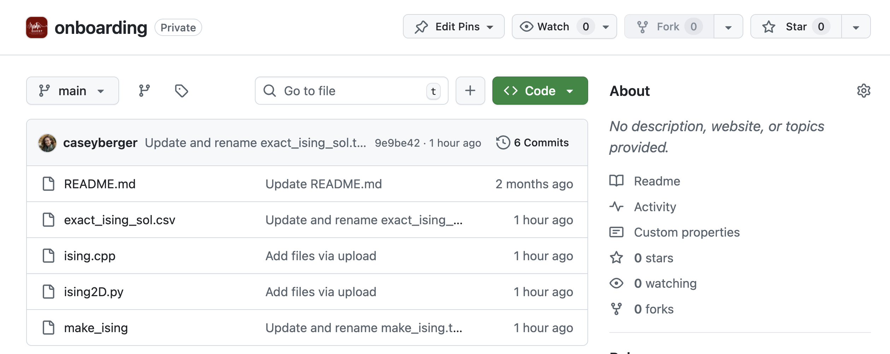
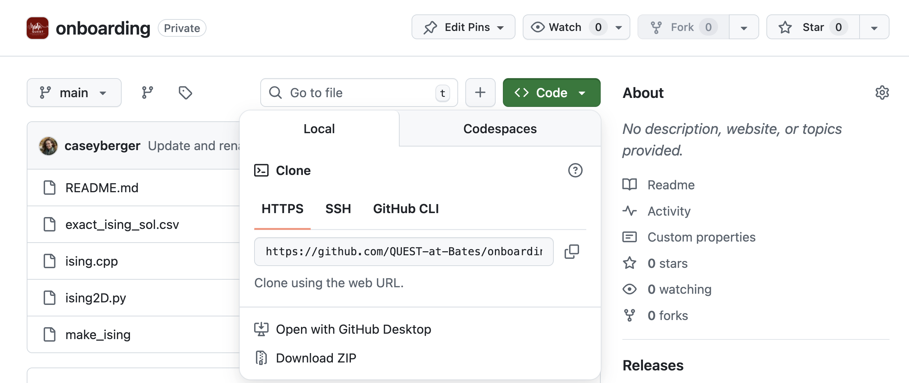

# Accessing Leavitt

Leavitt has 9 compute nodes, forming a 1152 core cluster with two 64-core AMD EPYC processors and 512 GB per node (details here: [https://www.bates.edu/research-resources/leavitt-hpc-cluster/leavitt-hardware-specs/](https://www.bates.edu/research-resources/leavitt-hpc-cluster/leavitt-hardware-specs/)). Queuing is provided by SLURM. It was professionally installed and tested by Dell and is generally well-run.

Backups are **not provided for /home**. There is no other scratch disk space on the machine, everything is in /home.  You will have to transfer data to Etna in order to analyze it.

## Logging in

Leavitt can be logged into at leavitt.bates.edu using ssh. On campus all you need to do is this:

```bash
ssh yourusername@leavitt.bates.edu
```

This uses default port 22 on campus.

If you want to sign in off campus, you have to use port 222, and you must specify it in your ssh login:

```bash
ssh -p 222 yourusername@leavitt.bates.edu
```

It will prompt you to enter your password -- this will be your Bates password. You won't be able to see what you're typing so just be careful.

## Navigating with the command line

Read [this article](https://www.codecademy.com/article/ready-command-line-commands) on command line commands and familiarize yourself with how to change directories (cd), list the files in a directory (ls), copy files (cp and cp -r), and determine your directory’s address (pwd). Hang on to this article, because you may need to do other operations and it’s a useful resource.

When you log in to leavitt, you will be in your home directory. You can find the address to your current directory by using the command

```bash
pwd
```

You can see what is in your current directory by using the command

```bash
ls
```

## Navigating to the project directory

You can do some work in your home directory, but you will need to submit jobs out of the project directory. That is the “BergerLab” directory and its address is /home/projects/BergerLab/

You can get there with the “change directory” command and the address like this:

```bash
cd /home/projects/BergerLab/
```

## Creating a new directory

Using what you learned about the command line, inside the project directory, create a directory with your Bates username as the name (e.g., for me it would be `cberger3`).

# Compiling code

We are going to use pre-written code for this exercise.

## Cloning files from GitHub

In a web browser, navigate to the [onboarding repository](https://github.com/QUEST-at-Bates/onboarding) in the Bates QUEST organization. You will first need to make a GitHub account and send me your GitHub username so I can give you access to that repo.



Click on the green “Code” button, and you will see a drop-down window appear:



Copy the link shown there.

In Leavitt, navigate to the directory you created with your username so you can clone the github repo. This is just how github “copies” from their main website to whatever machine you are working on. The way to do this is the following command

```bash
git clone LINK-YOU-COPIED-EARLIER
```

where you paste the link you copied after “clone.”

<div class="alert alert-success">
✅

Clone the onboarding github repo to your directory in the BergerLab directory on Leavitt
</div>

If you have any problems arise in this process, let me know in the slack.

The directory you cloned is called `onboarding`. Navigate into this directory and look at what’s inside. You should see the following files:

- `README.md`
    - This is a text file (markdown or .md) with some description about the onboarding folder
- `exact_ising_solution.csv`
    - This is another text file with comma separated values (.csv) which contains the exact solution for the Ising Model in 2D.
- `ising.cpp`
    - This is a C++ code, which contains the blueprints for a program that will simulate the Ising Model using C++
- `make_ising`
    - This is called a “makefile” and it contains the instructions to the computer for how to assemble your code.
- `ising2D.py`
    - This is a Python program that will simulate the Ising Model using Python. It does not need to be compiled.

## Compiling

Some programming languages (e.g. C++, Fortran) require you to compile your code before you can run it. This is like sending instructions to the computer to assemble a program that runs according to the blueprint you laid out in your code. Other programming languages (e.g. Python, Julia) do not require this. 

To compile a code, you have to write a secondary code called a “makefile” which contains all the instructions for how to assemble the program from your code. The instructions are in another programming language, which speaks directly to the computer via the compiler. Think of the makefile as a kind of translation. You can read more about makefiles [here](https://makefiletutorial.com/), but I have already written the makefile for the ising.cpp code.

What you need to know at this point is that in the makefile, you define a command that you use to assemble the code into what is called an “executable” — the thing that you actually run on your computer. Use the `less` command to look inside the `make_ising` file and learn how to use the makefile.


<div class="alert alert-success">
✅

Once you have read over the `make_ising` file, run the command that will create your executable.

</div>

You should now have a new item in your folder: an executable called just `ising`. This is what you will use to run the simulation, but first we have to learn how to submit jobs to the scheduler.

# Submitting a job

Leavitt uses SLURM to schedule compute jobs across the 9 nodes. This is to prevent people from accidentally overclocking a node, and also to make sure everyone gets a fair amount of access (i.e. one person can’t use all 9 nodes for a month straight while everyone else waits for them to finish).

The first and most important thing is this

<div class="alert alert-danger">
❗

The node you are on when you log in to Leavitt is **not** one of the 9 nodes. This is a special node called the “login node” or a “head node.” Never **ever** run code on the login node, because if you fill that node’s processors up with your work, you can block other people from logging in.

You should use the login node for simple code editing and writing and submitting SLURM scripts. The only way you should run code is by submitting jobs to the scheduler (in the process described below). For more on login nodes and what kinds of tasks are appropriate on them, see [this article](https://www.docs.arc.vt.edu/usage/abuse.html) from Virginia Tech.

If you get to the point where you need to test code interactively on Leavitt or you have very large code that needs a long time to compile, we will talk about how to request an interactive session, which means the scheduler gives you access to a compute node for a set amount of time to test things out.

</div>

To submit something to run, you will have to create a SLURM submission script and run that. Let’s say you call your slurm script `slurmscript.sh` then you would run it with

```bash
sbatch slurmscript.sh
```

You can name your script whatever you would like, but it must end with .sh. The Leavitt documentation on the Bates website describes [how to make a slurm script](https://www.bates.edu/research-resources/leavitt-hpc-cluster/running-jobs/#Slurm), but there are a few examples below.

The most important thing is to remember to assign it to the correct partition. The list of available partitions is [here](https://www.bates.edu/research-resources/leavitt-hpc-cluster/running-jobs/#Available-Partitions). You should run all your jobs on the `defq` partition (this means “default queue”).

An example slurm script set up for a compiled C++ code with the executable name `mycode` and for a Python script with the name `mycode.py` are shown below

### slurmscriptcpp.sh

```bash
#!/bin/bash
#
#SBATCH --job-name=testcpp               # Assign a name to the job
#SBATCH --partition=defq              	# Which partition to use
#SBATCH --nodes=1                   	  # Number of nodes
#SBATCH --output=testcpp%j.log  # Output that would print to the screen
                                        # can be saved here
#SBATCH --error=err_testcpp%j.log  # Errors that arise will be saved here

pwd; hostname; date

./mycode

date
```

The #SBATCH lines allow you to define certain instructions for the scheduler. There are lots of options you can use here, but these are the ones you should always have. (Note: not everyone agrees, but this will be the requirement for this research group, so that we can have consistent organization of our code). Here’s an explanation of each line of this code and why I recommend it:

- `#!/bin/bash` This is required to tell the computer what kind of script this is
- `#SBATCH --job-name=testcpp` This line assigns your code with the name testcpp. You can choose what name you want to assign, but it’s useful to have so you can easily see what jobs are running in the queue.
- `SBATCH --partition=defq` This line tells the scheduler which partition to put your job in. Students all use the default queue, so this should always be what you put.
- `#SBATCH --nodes=1`  This line tells the scheduler how many nodes you need. Until you are working with parallelized code, this will always be one. When you start working with parallelized code, we will talk about how to modify this given the structure of the code.
- `#SBATCH --output=testcpp%j.log` This line will create a file that will store anything your code would normally print to the screen. So if you have any checkpoints built in (i.e. before a loop, the code prints “beginning loop over x”), they will go into this file. Having an output file like this is useful for debugging, so I recommend including it. I also recommend using the same name you used for the job above (`testcpp` in this example), to keep things organized. The `%j` will just add the job number assigned by the scheduler once it starts running.
- `#SBATCH --error=err_testcpp%j.log` This line will create a file to store any error messages that the computer sends you during your code’s run. This is also useful for debugging. Just as above, I recommend using the same name but adding `err_` before it so you can distinguish error files from output files and the `%j` will just add the job number assigned by the scheduler.
- `pwd; hostname; date` These three commands will put in your output file the following things: the working directory where your code is located, the node the scheduler assigned your job to, and the date and time that it starts.
- `./mycode` This is the command that runs your code. For a compiled C++ executable, you run it using the `./` command and the executable’s name.
- `date` This just prints the date and time that the code finishes. This is useful for checking timing of your jobs and determining how long they are taking.

### slurmscriptpython.sh

```bash
#!/bin/bash
#
#SBATCH --job-name=testpy               # Assign a name to the job
#SBATCH --partition=defq              	# Which partition to use
#SBATCH --nodes=1                   	  # Number of nodes
#SBATCH --output=testpy%j.log           # Output that would print to the screen
                                        # can be saved here
#SBATCH --error=err_testpy%j.log        # Errors that arise will be saved here

pwd; hostname; date

module load anaconda

python mycode.py

date
```

For all the #SBATCH commands, this slurm script is the same at the top. Here are the things that are different when running a python code:

- `module load anaconda`  When working with Python, you will likely be using special libraries that have been written for Python. In this group, we will almost always be using numpy, scipy, and pandas. The module anaconda contains all these libraries, and you have to load them before you can run the code.
- `python mycode.py` This is the command that runs your code for Python. Instead of the `./` command, we use the `python` command. Since Python doesn’t require compilation, you use the name of the python script including the .py extension.

## Write and submit SLURM scripts

Your next task is to create your own SLURM scripts for the C++ and the Python versions of the Ising Model. You can create these in a text file on your computer and use GitHub or [scp](https://umbc.atlassian.net/wiki/spaces/faq/pages/1576534018/Uploading+Data+to+the+Cluster) to copy them to Leavitt or you can use a text editor in Leavitt to do it in-place (Leavitt supports both [emacs](https://www.cs.colostate.edu/helpdocs/emacs.html) and [vi](https://www.cs.colostate.edu/helpdocs/vi.html)).


<div class="alert alert-success">
✅

Write and submit your scripts. 
When they are finished running, send me the error and output files (everything with a .log extension) via slack.

</div>

After you have submitted a job, you can check it’s status with the command `squeue`. If the cluster is busy, it might help to just check your own jobs, which you can do with

```bash
squeue -u yourBatesusername
```

# Copying to Etna

The output for any job you submit will be written in the folder you submitted from (unless you have specified otherwise in your code). Since Leavitt is not backed up and does not connect to our Metis Jupyter server directly, you will have to copy the data to Etna in order to work with it.

```bash
cp -r datafolder/ /usr/netapp/etna/Scholarship/Faculty\ Name/Students/Student\ Name
```

<div class="alert alert-danger">
❗

Important: those back slashes between the first and last name are crucial — it’s so that the spaces are included in the file name. If they are not, you will get an error message saying e.g. `cp: target 'xxxx/xxxx/' is not a directory` where the xxx is part of your filepath that comes after a space

</div>

Once the data is copied to Etna, you can access it in Metis and work with it through JupyterLab.

