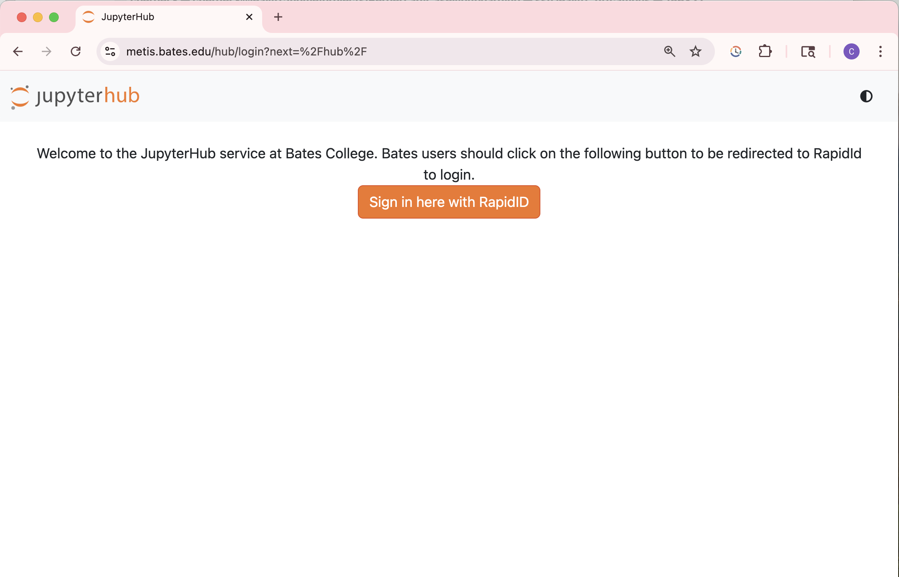
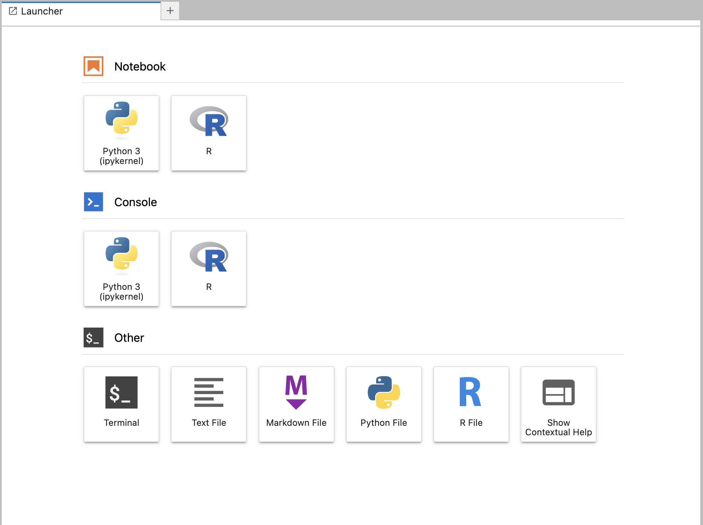

# Working in Metis

Accessing Metis is the easiest part of this process. You will then have to set up a link to Etna in your home directory on Metis, which is a little harder.

To access Metis, just navigate to [metis.bates.edu](http://metis.bates.edu) in your web browser. You should see this



Click on “Sign in Here with RapidID” and log in with your Bates credentials.

Now you should see a home directory with a GUI (Graphical User Interface) that allows you to create folders, upload and download files, open various code editors, and even use a terminal. The first thing you are going to do is open a terminal.

Look in the Launcher (on the right hand side of the screen) and select under “Other” the “Terminal” option.



In the terminal, use the command “cd” to ensure you are in your home directory. Then you will create a symlink. The way to do this is shown below — you will have to modify this to match your specific scenario (entering your advisor’s name where it says Faculty\ Name and your own where it says Student\ Name). Remember those backslashes are critical! Also the “.” at the end is also critical — it puts the Etna link in your current directory (which should be your home directory). 

```bash
ln -s /usr/netapp/faculty/cberger3/etna/Scholarship/Faculty\ Name/Students/Student\ Name .
```

When you complete this, you should see a new folder appear in the browser to the left — it will have your name on it, and if you open it, you should see the data you copied earlier inside.

Now you can open a Jupyter Notebook using the Launcher and start analyzing your data!