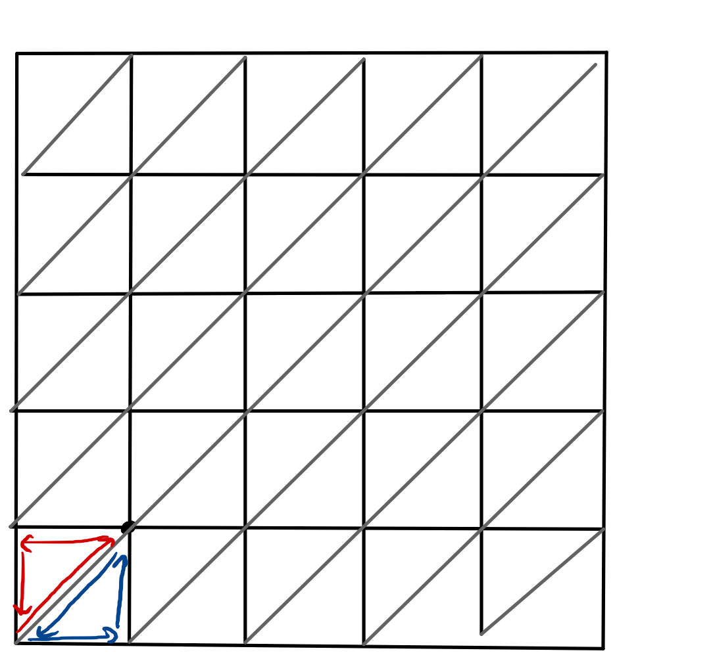

# What is QL?

The topological charge, $Q_{L}$, is a stable defect in the fields. It takes on quantized values (it is not a continuous number), and it characterizes phases of matter. Examples of other topological charges include the number of vortices formed in rotating Bose-Einstein condensates (as the rotation increases in a continuous way, the number of vortices experiences a quantized jump from 0 to 1, and so on). The vortices themselves would be examples of solitons, or topological defects, and the number of them is the topological charge of the system. 

 Fill in with more detail. 

What is the significance of QL?

Is it extensive or intensive?
    
How does it relate to the mass gap?
    
Is there a measurable quantity that this relates to or represents?

## Calculating and regularizing 

The topological charge has been defined via sums over triangles created by cutting each square plaquette along the diagonal. Each vertex is labeled (numbered counter-clockwise), such that we call the fields at the sites of the vertices $\vec{\phi}_{1},$ $\vec{\phi}_{2},$ and $\vec{\phi}_{3}$.

{width=300}

At each lattice site, there are six adjacent triangles which have a vertex that includes that site. To avoid triple-counting, we "assign" each vertex the two triangles in the positive direction (in x and y), as shown for lattice site (0,0) in the image above. Note the directionality -- contributions to the charge from each triangle are calculated moving counter-clockwise from its primary vertex.

The topological charge over each triangle obeys

$$\exp(2 \pi i Q_{L}(\Delta)) = \frac{1}{\rho}\left(1 + \vec{\phi}_{1}\cdot\vec{\phi}_{2} + \vec{\phi}_{2}\cdot\vec{\phi}_{3} + \vec{\phi}_{3}\cdot\vec{\phi}_{1} + i \vec{\phi}_{1} \cdot (\vec{\phi}_{2}\times\vec{\phi}_{3})\right)$$

with 

$$\rho^{2} = 2(1+\vec{\phi}_{1}\cdot\vec{\phi}_{2})(1 + \vec{\phi}_{2}\cdot\vec{\phi}_{3})(1+ \vec{\phi}_{3}\cdot\vec{\phi}_{1})$$ 

and 

$$Q_{L}(\Delta) \in \left[-\frac{1}{2}, \frac{1}{2}\right]$$

We use the arcsin of the quantity $\exp(2 \pi i Q_{L}(\Delta))$ to compute $Q_{L}(\Delta)$, as in C++ the domain of arcsin is symmetric about $0$, which prevents the need to adjust the domain to fit the expectation given above.

One challenge in calculating this on the lattice is that the spin configurations on a triangle must obey a specific set of relationships, as given in [Berg and Lüscher, 1981](https://doi.org/10.1016/0550-3213(81)90568-X):

$$\vec{s}_{1}\cdot(\vec{s}_{2}  \times \vec{s}_{3})=0$$
and 
$$ 1 + \vec{s}_{1} \cdot \vec{s}_{2} \cdot \vec{s}_{3} +\vec{s}_{3}\cdot \vec{s}_{1} \leq 0$$

Where $\vec{s}_{1}, \vec{s}_{2}$ and $\vec{s}_{3}$ here represent the vector fields $\vec{s}$ (which we refer to as $\vec{\phi}$ in this work) on the three counterclockwise vertices of the triangles defined above.

The randomness introduced in Monte Carlo simulations can make it challenging to ensure that the spin configurations we choose satisfy these equations, but it is crucial that we do so. In all cases where either of these relations is defied, the total topological charge $Q_{L} = \sum_{\Delta} Q_{}(\Delta)$ returns non-integer (i.e. invalid) numbers. Ensuring that these relations are met adds computational time to our simulation, but is well worth the effort.

