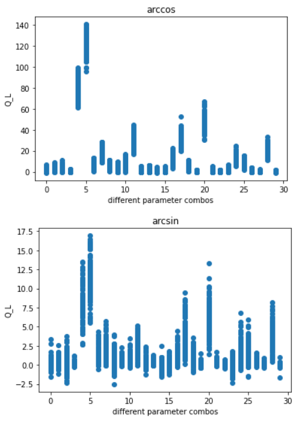
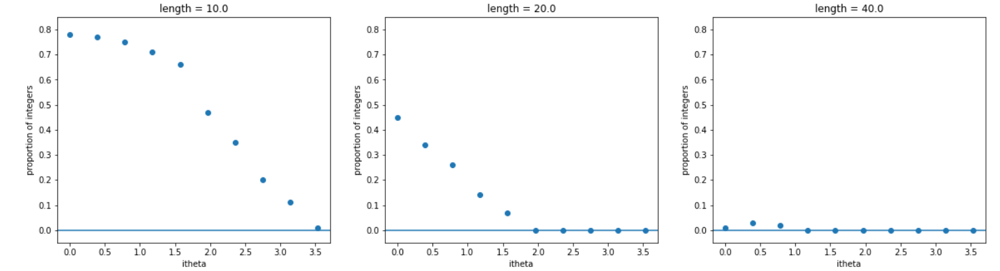

 We solved this problem -- add to these notes how we did this (see your notion notes from last year)

Still explain the challenges and how you solved the problem

# What is $Q_{L}$?

The topological charge, $Q_{L}$, is a stable defect in the fields. It takes on quantized values (it is not a continuous number), and it characterizes phases of matter. Examples of other topological charges include the number of vortices formed in rotating Bose-Einstein condensates (as the rotation increases in a continuous way, the number of vortices experiences a quantized jump from 0 to 1, and so on). The vortices themselves would be examples of solitons, or topological defects, and the number of them is the topological charge of the system. 

 Fill in with more detail. 

What is the significance of QL?

Is it extensive or intensive?
    
How does it relate to the mass gap?
    
Is there a measurable quantity that this relates to or represents?

## Calculating and regularizing 

The topological charge has been defined via sums over triangles created by cutting each square plaquette along the diagonal. Each vertex is labeled (numbered counter-clockwise), such that we call the fields at the sites of the vertices $\vec{\phi}_{1},$ $\vec{\phi}_{2},$ and $\vec{\phi}_{3}$.

{width=300}

At each lattice site, there are six adjacent triangles which have a vertex that includes that site. To avoid triple-counting, we "assign" each vertex the two triangles in the positive direction (in x and y), as shown for lattice site (0,0) in the image above. Note the directionality -- contributions to the charge from each triangle are calculated moving counter-clockwise from its primary vertex.

The topological charge over each triangle obeys

$$\exp(2 \pi i Q_{L}(\Delta)) = \frac{1}{\rho}\left(1 + \vec{\phi}_{1}\cdot\vec{\phi}_{2} + \vec{\phi}_{2}\cdot\vec{\phi}_{3} + \vec{\phi}_{3}\cdot\vec{\phi}_{1} + i \vec{\phi}_{1} \cdot (\vec{\phi}_{2}\times\vec{\phi}_{3})\right)$$

with 

$$\rho^{2} = 2(1+\vec{\phi}_{1}\cdot\vec{\phi}_{2})(1 + \vec{\phi}_{2}\cdot\vec{\phi}_{3})(1+ \vec{\phi}_{3}\cdot\vec{\phi}_{1})$$ 

and 

$$Q_{L}(\Delta) \in \left[-\frac{1}{2}, \frac{1}{2}\right]$$

We use the arcsin of the quantity $\exp(2 \pi i Q_{L}(\Delta))$ to compute $Q_{L}(\Delta)$, as in C++ the domain of arcsin is symmetric about $0$, which prevents the need to adjust the domain to fit the expectation given above.

One challenge in calculating this on the lattice is that the spin configurations on a triangle must obey a specific set of relationships, as given in [Berg and Lüscher, 1981](https://doi.org/10.1016/0550-3213(81)90568-X):

$$\vec{s}_{1}\cdot(\vec{s}_{2}  \times \vec{s}_{3})=0$$
and 
$$ 1 + \vec{s}_{1} \cdot \vec{s}_{2} \cdot \vec{s}_{3} +\vec{s}_{3}\cdot \vec{s}_{1} \leq 0$$

Where $\vec{s}_{1}, \vec{s}_{2}$ and $\vec{s}_{3}$ here represent the vector fields $\vec{s}$ (which we refer to as $\vec{\phi}$ in this work) on the three counterclockwise vertices of the triangles defined above.

The randomness introduced in Monte Carlo simulations can make it challenging to ensure that the spin configurations we choose satisfy these equations, but it is crucial that we do so. In all cases where either of these relations is defied, the total topological charge $Q_{L} = \sum_{\Delta} Q_{}(\Delta)$ returns non-integer (i.e. invalid) numbers. Ensuring that these relations are met adds computational time to our simulation, but is well worth the effort.

 Add some figures demonstrating the relationship between non-integer $Q_{L}$ and exceptional spin configurations.
    
Some definitions to introduce: exceptional triangle for a single set of invalid relationships, exceptional configuration for any lattice that has at least one exceptional triangle.

# Non-integer $Q_L$

Early tests of the code revealed that it was not yielding integer values for $Q_L$, at least not all the time. When the code returned an integer value for $Q_L$, it was always one of the following: $-1, 0, 1, 2, 3$. And in the event that $Q_L$ was a non-integer, it would often be a very large number. This is true for calculations of $Q_L$ using both arccos and arcsin, but the problem is much more severe for arccos (e.g. when arccos was used to compute $Q_L$, it could go up to $140$, while arcsin's largest values were under $20$). We discuss possible reasons for the difference in output using arcsin and arccos [below](#QL_trig_comp).

In the figure below, we can see results for $Q_L$ calculated using arccos (top) and arcsin (bottom). The x-axis represents individual runs (the numbering is arbitrary, but represents unique parameter combinations). On the y-axis are the values of $Q_L$ calculated at 100 steps in the Monte Carlo trajectory, demonstrating the spread of values.

**Figure and analysis credit: Andy Esseln, Smith College**

 Update this figure -- reduce alpha and maybe plot both on the same axes to show the massive difference in size? Is there a way to highlight where integers do occur or are these all non-integer values?

Length and topological term $\theta$ clearly both have an effect on the number of integer values of $Q_L$. The effect of length appears to be stronger than that of $i\theta$, and its existence makes sense, as there are more lattice sites and more places where problems can arise and compound. Interestingly, though, it appears not just to decrease the number of integer values, but the fraction of values which are integers decreases rapidly with lattice length.

It is less clear how $i \theta$ introduces this issue, although it could be as simple as shifting $\theta$ away from zero shifts $Q_L$ away from zero (an integer) and therefore the effects of length are more obvious at higher $i \theta$. The figure below clearly illustrates the larger effect of length, as for $L = 40$, we have almost zero integer values for $Q_{L}$ even at $i \theta = 0$.

**Figure and analysis credit: Andy Esseln, Smith College**

 Maybe add another figure with $L$ on the x axis so we can see the shape of the dependence of prop(integers) on $L$?

## Exceptional triangles

The method used to regularize the topological charge by defining it on triangles rather than points is meant to yield integer values for $Q_{L}$. However, this is only the case if the field configurations are not exceptional (see [Berg and Lüscher, 1981](https://doi.org/10.1016/0550-3213(81)90568-X)). Exceptional configurations occur when either of the following conditions are met:

$\vec{\phi}_{1} \cdot (\vec{\phi}_{2} \times \vec{\phi}_{3}) = 0$

or 

$1 + \vec{\phi}_{1} \cdot \vec{\phi}_{2} +  \vec{\phi}_{2} \cdot \vec{\phi}_{3} +  \vec{\phi}_{3} \cdot \vec{\phi}_{1} \leq 0$.

While it appears that the existence of exceptional configurations always leads to non-integer values of $Q_{L}$, it is also the case that in some instances with no exceptional configurations, we still have non-integer values for the topological charge. This means that exceptional configurations cannot be the only cause of this breakdown, although it does appear to be a factor.

## C++ asin and acos 

Add a few figures here and discuss the differences in domain for asin and acos in C++ -- also why might it be that even after converting the results of acos to match those of asin, some of them are so wrong?? Are these the cases that occur along the asymptote of asin?

